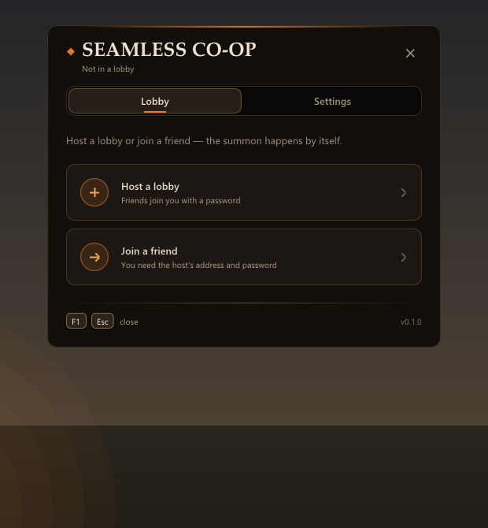
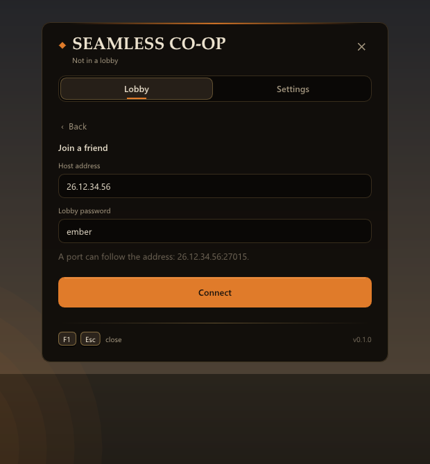
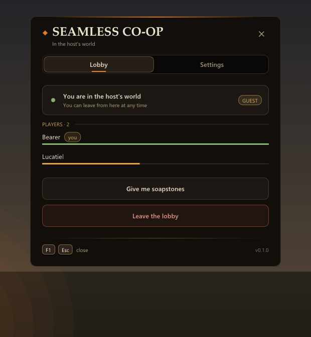
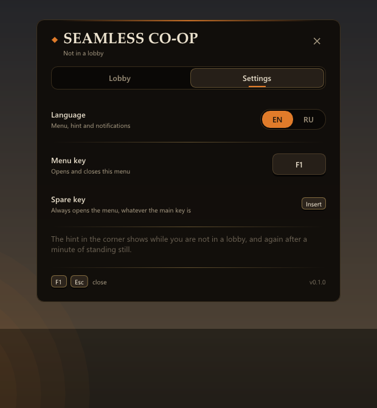
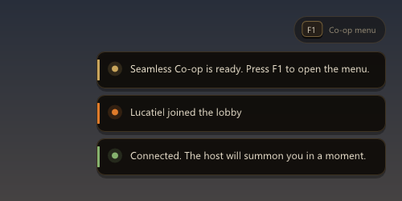
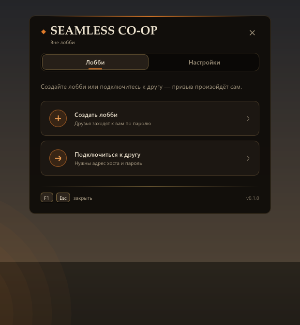
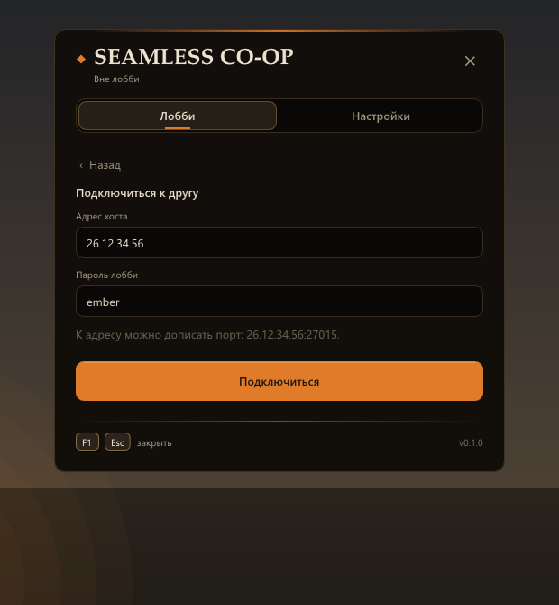
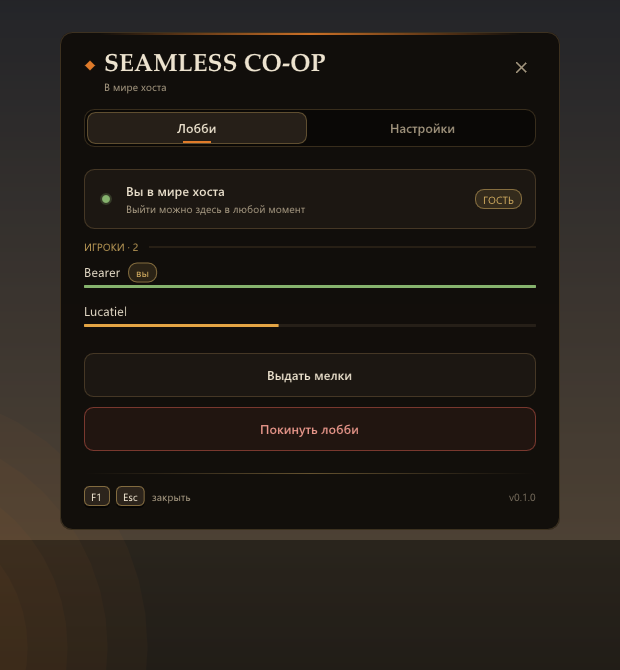
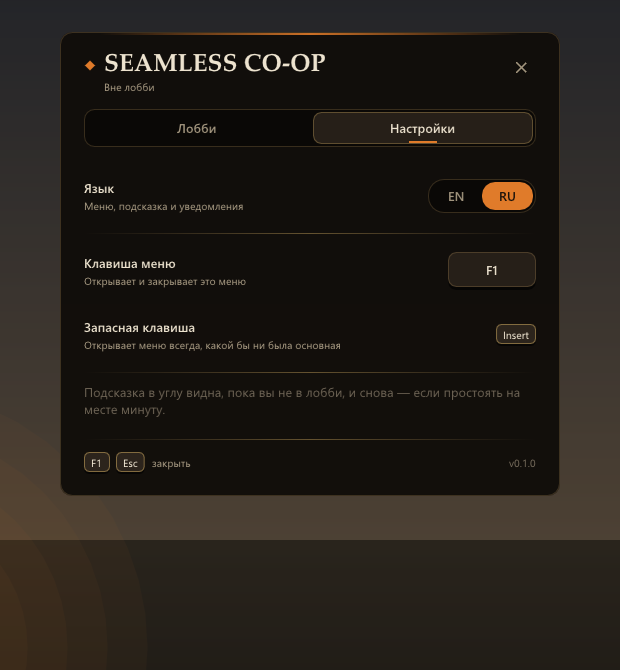
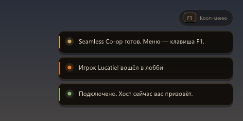

# Seamless-DarkSouls2
A pathetic attempt at LukeYui imitation

---

<p align="center">
<b>Seamless Co-op for Dark Souls II: Scholar of the First Sin</b> · version <b>0.1.0</b><br>
<a href="https://github.com/Restezzz/Seamless-DarkSouls2/releases/latest"><b>Download / Скачать</b></a><br>
English on the left · Русский справа
</p>

<table>
<tr>
<th width="50%">English</th>
<th width="50%">Русский</th>
</tr>

<tr>
<td valign="top">

## What it is

Co-op for Dark Souls II in the spirit of the Seamless Co-op mods for Elden Ring and Dark Souls III.
One player — the **host** — runs a small server on their PC. Friends connect to it over
**Radmin VPN**, join the host's lobby from an in-game menu and get summoned into the host's
world by themselves. Then you play together, and the co-op does not fall apart after every
boss, death or area.

Everything goes through your own server, so the game never talks to the official servers:
no invasions, no strangers.

0.1.0 is the first version, played by two people. See **Known issues** below.

</td>
<td valign="top">

## Что это

Кооператив для Dark Souls II в духе Seamless Co-op для Elden Ring и Dark Souls III.
Один игрок — **хост** — запускает у себя маленький сервер. Друзья подключаются к нему через
**Radmin VPN**, заходят в лобби хоста из меню прямо в игре, и их сам призывает в мир
хоста. Дальше играете вместе, и кооп не разваливается после каждого босса, смерти или
перехода между локациями.

Всё идёт через свой сервер, игра не ходит на официальные серверы: никаких вторжений и
случайных людей.

0.1.0 — первая версия, её проверяли вдвоём. Что пока не работает — в разделе
**Известные проблемы** ниже.

</td>
</tr>

<tr>
<td valign="top">

## Features

1. **Summon without the ritual.** The joiner's sign is placed by itself and the host summons
   it by itself; the sign shows up right under the host's feet. No effigies, no soapstone
   hunting, and the phantom timer never runs out.
2. **The co-op doesn't end.** Boss kills, deaths, bonfires and area changes don't send the
   guest home.
3. **Go anywhere.** No co-op fog walls between areas: the guest walks the host's whole world,
   including places where summoning normally can't happen.
4. **Bonfires in someone else's world.** The guest sits at bonfires in the host's world;
   resting brings the enemies back for both players.
5. **Chests and items in the host's world.** The guest loots them; what the guest picks up
   is theirs only (the host keeps their own copy), and it is gone from the guest's own world
   afterwards, so nothing is looted twice.
6. **Death doesn't end the session.** A guest who dies comes straight back to the host's
   world, at the bonfire they last rested at there. The host dying doesn't kick the guest.
7. **Boss fights together.** The guest follows the host through the boss fog; nobody comes
   back until the fight is decided or both are dead.
8. **In-game menu** (F1, and Insert always): a lobby with a password, the player list,
   English and Russian, the key can be changed.
9. **Rejoin after a crash.** The lobby and the server replace the crashed player's old
   entry at once.
10. **Crash log.** A crash leaves where it happened and the call stack in the log, plus a
    dump file for the bug report.
11. **One-click server for the host.** `StartServer.bat` finds the Radmin address, starts
    the server and prepares the key file for friends.

</td>
<td valign="top">

## Возможности

1. **Призыв без ритуала.** Знак подключающегося ставится сам, хост призывает его сам, знак
   появляется прямо у хоста под ногами. Не нужны куколки и мелки, таймер фантома не
   кончается.
2. **Кооп не заканчивается.** Убийство босса, смерть, костёр и переход между локациями не
   отправляют гостя домой.
3. **Любые локации.** Нет кооп-тумана между областями: гость ходит по всему миру хоста, в том
   числе там, где призыв обычно невозможен.
4. **Костры в чужом мире.** Гость сидит у костров в мире хоста; отдых возвращает врагов у
   обоих игроков.
5. **Сундуки и предметы в мире хоста.** Гость их собирает; подобранное гостем достаётся
   только ему (у хоста остаётся своя копия), и в его собственном мире этого потом нет —
   ничего не собирается дважды.
6. **Смерть не рвёт сессию.** Погибший гость сразу возвращается в мир хоста — к костру, у
   которого последний раз отдыхал там. Смерть хоста гостя не выкидывает.
7. **Боссы вместе.** Гость проходит в туман босса вслед за хостом; никто не возвращается,
   пока бой не решится или не погибнут оба.
8. **Меню в игре** (F1, и всегда Insert): лобби с паролем, список игроков, английский и
   русский, клавишу можно поменять.
9. **Возврат после вылета.** Лобби и сервер сразу заменяют старую запись вылетевшего игрока.
10. **Журнал вылетов.** При вылете в логе остаются место и цепочка вызовов, а рядом —
    файл дампа для отчёта.
11. **Сервер в один клик.** `StartServer.bat` сам находит адрес Radmin, запускает сервер и
    готовит файл-ключ для друзей.

</td>
</tr>

<tr>
<td valign="top">

## What you need

- **Dark Souls II: Scholar of the First Sin** on Steam (PC), for every player.
- **Windows 10 or 11.**
- **[Radmin VPN](https://www.radmin-vpn.com/)** (free) on every PC, everybody in the same
  Radmin network. Hamachi works too.
- This mod: one archive for the host, one for friends (below).

## Download

Open the **[latest release](https://github.com/Restezzz/Seamless-DarkSouls2/releases/latest)**
and take one archive:

- **the host** (the player friends join): `Seamless-DS2-0.1.0-host.zip`
- **friends**: `Seamless-DS2-0.1.0-joiner.zip`

Older versions are on the [Releases](https://github.com/Restezzz/Seamless-DarkSouls2/releases)
page.

</td>
<td valign="top">

## Что нужно

- **Dark Souls II: Scholar of the First Sin** в Steam (ПК), у каждого игрока.
- **Windows 10 или 11.**
- **[Radmin VPN](https://www.radmin-vpn.com/ru/)** (бесплатный) на каждом компьютере, все в
  одной сети Radmin. Hamachi тоже подойдёт.
- Этот мод: один архив для хоста, другой для друзей (ниже).

## Скачать

Открой **[последний релиз](https://github.com/Restezzz/Seamless-DarkSouls2/releases/latest)**
и возьми один архив:

- **хосту** (к нему подключаются друзья): `Seamless-DS2-0.1.0-host.zip`
- **друзьям**: `Seamless-DS2-0.1.0-joiner.zip`

Прошлые версии — на странице [Releases](https://github.com/Restezzz/Seamless-DarkSouls2/releases).

</td>
</tr>

<tr>
<td valign="top">

## Host: setting up (once)

1. Install Radmin VPN, create a network (**Network → Create network**) and give your friends
   its name and password.
2. Open the game folder: Steam → right-click Dark Souls II → **Manage → Browse local files**.
   It's `...\steamapps\common\Dark Souls II Scholar of the First Sin\Game\`, the folder with
   `DarkSoulsII.exe`.
3. Extract **`Seamless-DS2-0.1.0-host.zip`** into it (replace `dinput8.dll` if asked).
4. Run **`StartServer.bat`**. The first time Windows may ask about the firewall — allow it.
   The window shows **your address for friends** (26.x.x.x) and where the key file
   `ds2_server_public.key` is (in the game folder).
5. Send your friends that address and the key file. Once is enough.

</td>
<td valign="top">

## Хост: настройка (один раз)

1. Поставь Radmin VPN, создай сеть (**Сеть → Создать сеть**) и дай друзьям её название и
   пароль.
2. Открой папку игры: Steam → правый клик по Dark Souls II → **Управление → Просмотреть
   локальные файлы**. Это `...\steamapps\common\Dark Souls II Scholar of the First Sin\Game\`,
   там лежит `DarkSoulsII.exe`.
3. Распакуй туда **`Seamless-DS2-0.1.0-host.zip`** (если спросит — заменить `dinput8.dll`).
4. Запусти **`StartServer.bat`**. В первый раз Windows может спросить про брандмауэр —
   разреши. Окно покажет **адрес для друзей** (26.x.x.x) и где лежит файл-ключ
   `ds2_server_public.key` (в папке игры).
5. Отправь друзьям этот адрес и файл-ключ. Достаточно одного раза.

</td>
</tr>

<tr>
<td valign="top">

## Friend: setting up (once)

1. Install Radmin VPN and join the host's network (**Network → Join network**).
2. Extract **`Seamless-DS2-0.1.0-joiner.zip`** into your game folder (same place as above).
3. Put the host's **`ds2_server_public.key`** into the same folder.
4. Open **`ds2_seamless_coop.ini`** in Notepad and write the host's address after
   `server_ip=`, for example `server_ip=26.12.34.56`. Save.

</td>
<td valign="top">

## Друг: настройка (один раз)

1. Поставь Radmin VPN и войди в сеть хоста (**Сеть → Присоединиться к сети**).
2. Распакуй **`Seamless-DS2-0.1.0-joiner.zip`** в свою папку игры (туда же, что и выше).
3. Положи в ту же папку **`ds2_server_public.key`** от хоста.
4. Открой **`ds2_seamless_coop.ini`** Блокнотом и впиши адрес хоста после `server_ip=`,
   например `server_ip=26.12.34.56`. Сохрани.

</td>
</tr>

<tr>
<td valign="top">

## Playing

1. **Host:** Radmin on → `StartServer.bat` → start the game from Steam, load your character.
2. **Host:** press **F1** → **Host a lobby** → any password → **Create lobby**. Tell the
   friend the password.
3. **Friend:** Radmin on → start the game (after the host's server is up) → load your
   character.
4. **Friend:** **F1** → **Join a friend** → the host's address and the password →
   **Connect**. Stand somewhere, not sitting at a bonfire: the sign is placed, the host's
   game summons it, and a loading screen takes you to the host.
5. Play. Leaving: menu → **Leave the lobby** (the guest goes home). When you are done the
   host runs `StopServer.bat`.

The menu opens with **F1** (changeable in Settings); **Insert** always opens it too, **Esc**
closes it. While the menu is open the game doesn't get your keys and mouse.

</td>
<td valign="top">

## Как играть

1. **Хост:** Radmin включён → `StartServer.bat` → запусти игру через Steam, загрузи
   персонажа.
2. **Хост:** нажми **F1** → **Создать лобби** → любой пароль → **Создать лобби**. Скажи
   пароль другу.
3. **Друг:** Radmin включён → запусти игру (после того как у хоста поднялся сервер) →
   загрузи персонажа.
4. **Друг:** **F1** → **Подключиться к другу** → адрес хоста и пароль →
   **Подключиться**. Встань где-нибудь, только не сиди у костра: знак поставится, игра
   хоста его призовёт, и после загрузки ты окажешься у хоста.
5. Играйте. Выйти: меню → **Покинуть лобби** (гость уходит домой). Наигрались — хост
   запускает `StopServer.bat`.

Меню открывается на **F1** (меняется в Настройках); **Insert** открывает его всегда, **Esc**
закрывает. Пока меню открыто, игра не получает клавиатуру и мышь.

</td>
</tr>

<tr>
<td valign="top">

## Screenshots







</td>
<td valign="top">

## Скриншоты







</td>
</tr>

<tr>
<td valign="top">

## Settings

`ds2_seamless_coop.ini` in the game folder. `true` is on, `false` is off. The language and
the menu key are easier to change in the menu itself.

| Setting | Default | What it does |
|---|---|---|
| `server_ip` | host: `127.0.0.1` | the host's server (friends: the host's Radmin address) |
| `auto_summon` | `true` | join through the menu → summoned by itself |
| `sign_under_feet` | `true` | the sign appears under the host's feet |
| `rest_sync` | `true` | resting brings enemies back for everyone |
| `loot_sync` | `true` | the guest's loot in the host's world |
| `free_travel` | `true` | no co-op fog between areas |
| `death_respawn` | `true` | a guest who dies comes back |
| `allow_invasions` | `false` | invasions |
| `language` | `auto` | `auto`, `en` or `ru` |
| `menu_key` | `F1` | the menu key |
| `debug_logging` | `true` | full log for bug reports |

</td>
<td valign="top">

## Настройки

`ds2_seamless_coop.ini` в папке игры. `true` — включено, `false` — выключено. Язык и клавишу
меню проще менять прямо в меню.

| Настройка | По умолчанию | Что делает |
|---|---|---|
| `server_ip` | хост: `127.0.0.1` | сервер хоста (у друзей — Radmin-адрес хоста) |
| `auto_summon` | `true` | вход через меню → призыв сам |
| `sign_under_feet` | `true` | знак появляется у хоста под ногами |
| `rest_sync` | `true` | отдых возвращает врагов у всех |
| `loot_sync` | `true` | добыча гостя в мире хоста |
| `free_travel` | `true` | нет кооп-тумана между локациями |
| `death_respawn` | `true` | погибший гость возвращается |
| `allow_invasions` | `false` | вторжения |
| `language` | `auto` | `auto`, `en` или `ru` |
| `menu_key` | `F1` | клавиша меню |
| `debug_logging` | `true` | подробный лог для отчётов |

</td>
</tr>

<tr>
<td valign="top">

## If something doesn't work

- **The game says it's offline.** The host's server isn't running (start `StartServer.bat`
  before the game), Radmin isn't connected, the key file is missing or comes from another
  host, or `server_ip` is wrong.
- **Nobody gets summoned.** Don't sit at a bonfire; check the lobby password; see the known
  issue about Majula.
- **A crash or a bug.** Open an [issue](https://github.com/Restezzz/Seamless-DarkSouls2/issues)
  and attach `ds2_seamless_coop.log` and any `ds2_seamless_crash_*.dmp` from the game folder
  of the player whose game crashed.
- **Removing the mod.** Delete `dinput8.dll` from the game folder.

## Known issues (0.1.0)

- Joining while standing where signs can't be placed (Majula) doesn't work yet.
- If both players die in a boss fight, the guest may come back at the boss instead of the
  bonfire.
- If the guest walks into a boss fog before the host, the boss stays idle.
- The guest can't talk to NPCs.
- The host sees the guest as a white phantom.

</td>
<td valign="top">

## Если не работает

- **Игра пишет «не в сети».** У хоста не запущен сервер (`StartServer.bat` — до игры), не
  подключён Radmin, нет файла-ключа или он от другого хоста, либо неверный `server_ip`.
- **Никого не призывает.** Не сиди у костра; проверь пароль лобби; см. известную проблему
  про Маджулу.
- **Вылет или ошибка.** Создай [issue](https://github.com/Restezzz/Seamless-DarkSouls2/issues)
  и приложи `ds2_seamless_coop.log` и файлы `ds2_seamless_crash_*.dmp` из папки игры того,
  у кого вылетело.
- **Удалить мод.** Удалить `dinput8.dll` из папки игры.

## Известные проблемы (0.1.0)

- Подключение, стоя там, где нельзя ставить знаки (Маджула), пока не работает.
- Если на боссе погибли оба, гость может вернуться к боссу, а не к костру.
- Если гость заходит в туман босса раньше хоста, босс стоит неактивным.
- Гость не может разговаривать с NPC.
- Хост видит гостя белым фантомом.

</td>
</tr>

<tr>
<td valign="top">

## What's in the repository

| Folder | What |
|---|---|
| `release/host` | what the host's archive is made of: the mod, the server, the start and stop scripts |
| `release/joiner` | what the friends' archive is made of |
| `scripts` | `package.ps1` builds the two archives |
| `mod` | source code of the mod (`dinput8.dll`) |
| `server` | the patch for the ds3os server and how to build it |
| `docs` | research notes on the game's internals (Russian) and screenshots |

## Building from source

Visual Studio 2022 (Desktop development with C++) and CMake 3.20+:

```bat
cmake -S mod -B mod/build -G "Visual Studio 17 2022" -A x64
cmake --build mod/build --config Release --target ds2_seamless_coop
```

The mod ends up in `mod/build/bin/Release/dinput8.dll`. The server: see
[`server/README.md`](server/README.md).

</td>
<td valign="top">

## Что лежит в репозитории

| Папка | Что там |
|---|---|
| `release/host` | из чего собирается архив хоста: мод, сервер, скрипты запуска и остановки |
| `release/joiner` | из чего собирается архив друзей |
| `scripts` | `package.ps1` собирает оба архива |
| `mod` | исходники мода (`dinput8.dll`) |
| `server` | патч к серверу ds3os и как его собрать |
| `docs` | заметки об устройстве игры и скриншоты |

## Сборка из исходников

Visual Studio 2022 (разработка классических приложений на C++) и CMake 3.20+:

```bat
cmake -S mod -B mod/build -G "Visual Studio 17 2022" -A x64
cmake --build mod/build --config Release --target ds2_seamless_coop
```

Мод появится в `mod/build/bin/Release/dinput8.dll`. Сервер — см.
[`server/README.md`](server/README.md).

</td>
</tr>

<tr>
<td valign="top">

## Credits and license

- Grew out of [scheissgeist/Seamless](https://github.com/scheissgeist/Seamless), the original
  DS2 Seamless Co-op mod (MIT, see `mod/LICENSE`).
- The server is [ds3os](https://github.com/TLeonardUK/ds3os) by Tim Leonard (MIT).
- [Dear ImGui](https://github.com/ocornut/imgui) (MIT) and
  [MinHook](https://github.com/TsudaKageyu/minhook) (BSD-2-Clause).
- This repository: MIT, see [`LICENSE`](LICENSE).

</td>
<td valign="top">

## Благодарности и лицензия

- Вырос из [scheissgeist/Seamless](https://github.com/scheissgeist/Seamless) — исходного мода
  DS2 Seamless Co-op (MIT, см. `mod/LICENSE`).
- Сервер — [ds3os](https://github.com/TLeonardUK/ds3os), автор Tim Leonard (MIT).
- [Dear ImGui](https://github.com/ocornut/imgui) (MIT) и
  [MinHook](https://github.com/TsudaKageyu/minhook) (BSD-2-Clause).
- Этот репозиторий — MIT, см. [`LICENSE`](LICENSE).

</td>
</tr>
</table>
